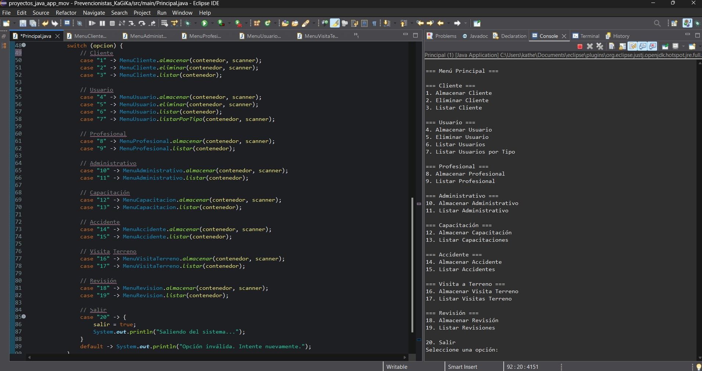

**_<h1 align="center">:vulcan_salute: Evaluación Final Modulo 2 Grupal :computer:</h1>_**

**<h2>Proyecto Desarrollado por:</h2>**

- Katherine Alderete Gómez
- Katrina González Alarcón
- Giorgio Interdonato Palacios


**<h3>:blue_book: Contexto:</h3>**

- En la última década, han aumentado los índices de accidentabilidad, especialmente en las empresas del rubro industrial, minero y construcción.
- Las cifras son alarmantes, a pesar de las leyes y normativas que obligan a las empresas a tomar todas las medidas necesarias para protegerla vida y salud de los trabajadores. Para dar cumplimiento a la normativa y mantener ambientes de trabajo seguros, muchas empresas se ven en la obligación de contratar asesoría profesional, lo cual representa un costo elevado y fomenta la disminución o la no implementación de medidas necesarias para la seguridad.
- Muchas de las empresas que han optado por no invertir en asesoría preventiva, se ven expuestas a aplicación de multas de las entidades fiscalizadoras, gastos por días perdidos en accidentabilidad, bajas en la producción, alzas en el pago de cotizaciones (al organismo administrador del seguro de accidentes del trabajo, ley 16.744), entre otros. Además, hay que considerar posibles demandas y pagos de indemnizaciones a los trabajadores y familiares afectados por accidentes del trabajo.
- Un grupo de profesionales ha fundado una compañía de asesorías en prevención de riesgos laborales y necesita una solución tecnológica que ayude a administrar los procesos que se deben ejecutar en cada una de las empresas que son clientes de la compañía.
- Este servicio finalmente pretende ofrecer una solución completa en prevención de riesgos para las empresas a un costo razonable, cumpliendo estrictamente todos los procesos necesarios para dar cumplimiento a la normativa vigente, mejorando los ambientes de trabajo, la productividad, contribuyendo a un ahorro económico.

**<h3>:orange_book: Problema:</h3>**

- La empresa no posee un sistema de información que le permita administrar toda la cantidad de información que se genera, ni controlar las actividades y el recurso humano.
- Existen problemas con la planificación de las visitas, generalmente los profesionales están en terreno por lo que no están disponibles para informarles sus actividades futuras.
- No existe registro del profesional que ha estado con mayor actividad ni se sabe dónde está cada uno.
- Las visitas a terreno a veces no tienen el efecto indicado por la falta de coordinación con el cliente.
- Asisten trabajadores que no tienen que ver con la charla, o bien, no se coordina la ejecución de la capacitación, lo que trae consigo multas para la empresa.
- No se tiene un control de los clientes que pagan y los que no, lo que hace que muchas actividades de los profesionales corran por cuenta de la empresa, generando desbalances financieros.
- Las actividades se registran en carpetas lo que dificulta el seguimiento de las asesorías y el resumen de resultados por empresa.
- Además, generalmente no se cumplen ciertas actividades de control de implementación de soluciones y a veces no se ha cumplido con la dirección del trabajo, lo que genera multas para los clientes, bajando la calidad del servicio.
- Los profesionales que han atendido la empresa esporádicamente han variado, no existiendo un registro de la totalidad de actividades preventivas realizadas y no se tiene certeza de los avances.

**<h3>:green_book: Solución:</h3>**

- Es necesario desarrollar una solución tecnológica que cubra los procesos de negocio descritos y que proponga una mejora en la gestión, el control, la seguridad, y disponibilidad de información para la empresa y sus clientes.
- El sistema debe permitir la planificación de actividades y el control de ejecución de éstas, la gestión de clientes, la coordinación entre la empresa, los profesionales y los clientes para la respuesta temprana ante incidentes de seguridad.
- Además, se requiere que el sistema genere reportes y estadísticas que ayuden a tomar de decisiones y mejorar el rendimiento de la empresa, considerando la carga laboral, y la demanda de clientes y las actividades que cada uno involucra para el cumplimiento de los contratos.
- Es imprescindible, mantener comunicación con los profesionales en todo momento, aún en terreno, y darle la posibilidad de realizar todas sus actividades aun no teniendo conectividad (internet), ya que muchas empresas se encuentran en zonas donde no hay conexión de ese tipo.


**<h3>:blue_book: Desarrollo:</h3>**

- Hasta el momento se han definido algunas entidades que darán vida al sistema, y las validaciones que se aplicarán en cada atributo. Estas son:

**Usuario:**
- Nombre: obligatorio, mínimo 10 caracteres, máximo 50
- Fecha de nacimiento: obligatorio, independiente si lo declara como una fecha o string, debe ser desplegado con el formato DD/MM/AAAA
- RUN: corresponde a un número menor a 99.999.999

**Cliente:**
- RUT: corresponde a un número menor a 99.999.999
- Nombres: obligatorio, mínimo 5 caracteres, máximo 30
- Apellidos: obligatorio, mínimo 5 caracteres, máximo 30
- Teléfono: obligatorio
- AFP: mínimo 4 caracteres, máximo 30
- Sistema de salud: 1 (Fonasa) o 2 (Isapre), debe ser solo una de las dos opciones indicadas
- Dirección: máximo 70 caracteres
- Comuna: máximo 50 caracteres
- Edad: obligatorio, número mayor o igual a cero, y menor a 150

**Profesional:**
- Título: obligatorio, mínimo 10 caracteres, máximo 50
- Fecha de ingreso: independiente si lo declara como una fecha o un String, debe ser desplegado con el formato DD/MM/AAAA

**Administrativo:**
- Área: obligatorio, mínimo 5 caracteres, máximo 20
- Experiencia previa: máximo 100 caracteres

**Capacitación:**
- Identificador: obligatorio, número interno de la capacitación manejado por la empresa
- RUT cliente: obligatorio
- Día: texto, día de la semana. Debe ser un valor permitido entre “lunes” y “Domingo” (en ese formato)
- Hora: debe ser una hora válida del día, en formato HH:MM (hora desde 0 a 23, minutos entre 0 y 59)
- Lugar: obligatorio, mínimo 10 caracteres, máximo 50
- Duración: máximo 70 caracteres
- Cantidad de asistentes: obligatorio, número entero menor que 1000

**Accidente:**
- Identificador del accidente: obligatorio, número interno manejado por la compañía.
- RUT Cliente: obligatorio
- Día: fecha del accidente, independiente si lo declara como una fecha o un String, debe ser desplegado con el formato DD/MM/AAAA
- Hora: debe ser una hora válida del día, en formato HH:MM (hora desde 0 a 23, minutos entre 0 y 59)
- Lugar: obligatorio, mínimo 10 caracteres, máximo 50
- Origen: máximo 100 caracteres
- Consecuencias: máximo 100 caracteres

**Visita en terreno**
- Identificador de la visita en terreno: obligatorio, número interno manejado por la compañía.
- RUT cliente: obligatorio
- Día: fecha del accidente, independiente si lo declara como una fecha o un String, debe ser desplegado con el formato DD/MM/AAAA
- Hora: debe ser una hora válida del día, en formato HH:MM (hora desde 0 a 23, minutos entre 0 y 59)
- Lugar: obligatorio, mínimo 10 caracteres, máximo 50
- Comentarios: máximo 100 caracteres

**Revisión**
- Identificador de la revisión: obligatorio, número interno manejado por la compañía.
- Identificador de la visita en terreno: obligatorio, número de la vista a la que se asóciala revisión.
- Nombre alusivo a la revisión: obligatorio, mínimo 10 caracteres, máximo 50
- Detalle para revisar: máximo 100 caracteres
- Estado: 1 (sin problemas), 2 (con observaciones), 3 (no aprueba), solo se
- Pueden ingresar los valores antes indicados.

**Respecto de las clases anteriores se conoce lo siguiente:**
- Un cliente puede tomar ninguna o muchas capacitaciones
- Un cliente puede registrar ninguno o muchos accidentes
- Un cliente debe tener una o muchas visitas en terreno
- Una visita en terreno debe tener una o más revisiones por cada ocasión

- **Todas las clases antes indicadas deben tener claramente declarados sus atributos** (definir el tipo de dato es parte de la solución), método toString (), un constructor que no reciba parámetros, un constructor que reciba todos los atributos de la clase como parámetros, métodos mutadores y métodos acceso res.

- Debe crear también una interface llamada Asesoría, la que debe tener declarado el método analizarUsuario (). Recuerde que, al ser una interface, solo deberá considerar la declaración del método.

- Las **clases Profesional, Administrativo y Cliente deben extender desde la clase Usuario**. Además, se pide que en cada clase existan los métodos adicionales siguientes:
    - **Usuario:** el método mostrarEdad (), el cual retorna un mensaje que diga “El usuario tiene X años” y en donde X es la edad del usuario en cuestión, y el método analizar Usuario (), que despliegue el nombre y el RUN. Considere que esta clase debe implementar la interface Asesoría.
    - **Cliente:** el método obtenerNombre(), que retorna un String con el nombre completo del cliente (nombres + apellidos), el método obtenerSistemaSalud() que de acuerdo al valor registrado en el objeto despliega el tipo de sistema de salud, y el método analizarUsuario() que debe desplegar los datos del método del mismo nombre correspondiente a la clase padre y la dirección del cliente junto con la comuna.
    - **Profesional:** debe implementar el método analizarUsuario(), el que debe desplegar los datos del método del mismo nombre de la clase padre, y el título y fecha de ingreso del profesional.
    - **Administrativo:** el método analizarUsuario(), el cual debe mostrar los datos del método del mismo nombre correspondiente a la clase padre, junto con el área a la que pertenece el administrativo y su experiencia previa.
    - **Capacitación:** el método mostrarDetalle(), que retorna un mensaje con el texto “La capacitación será en A a las B del día C, y durará D minutos”, en donde A es el lugar, B es la hora, C es el día y D son los minutos.
    - Cree la clase **Contenedor**, la cual deberá tener declarado como atributos dos listas: una lista de instancias de la interface Asesoria, y una lista de objetos de la clase Capacitacion. En la primera lista pueden ser almacenados distintos tipos de usuarios. Los métodos que debe contener esta clase son:
    - **Almacenar cliente:** permite agregar un nuevo cliente a la lista de instancias de la interface Asesoria.
    - **Almacenar profesional:** permite agregar un nuevo profesional a la lista de instancias de la interface Asesoria.
    - **Almacenar administrativo:** permite agregar un nuevo administrativo a la lista de instancias de la interface Asesoria.
    - **Almacenar capacitación:** permite agregar una nueva capacitación a la lista de instancias de la clase Capacitación.
    - **Eliminar usuario:** permite eliminar un usuario desde la lista de interfaces de Asesoría acuerdo con el RUN del usuario.
    - **Listar usuarios:** permite desplegar la lista completa de usuarios, independiente del tipo. En este método solo se deben desplegar los datos de la clase usuario.
    - **Listar usuarios por tipo:** recibe un tipo de usuario (cliente, administrador o profesional), y retorna los datos respectivos según el tipo de usuario.
    - **Listar capacitaciones:** este método despliega las capacitaciones registradas en la lista respectiva, junto con los datos del cliente al que está asociada dicha capacitación.

- Finalmente, cree la **clase Principal**, la que tendrá como objetivo crear una instancia de la clase Contenedor, lo que creará con ello las dos listas que considera esta clase. Posterior a esto, deberá crear un menú principal con nueve opciones: ocho para las acciones indicadas en el listado anterior, y una opción para salir del programa. En caso de que se ingrese una opción incorrecta, se debe pedir nuevamente. El programa solo terminará una vez que ingrese la opción de salida.

**<h3>:orange_book: Algunas consideraciones:</h3>**

- Como entregable, se pide subir a la plataforma respectiva en la sección creada para dicho efecto, un archivo comprimido en el que se disponga el proyecto creado de manera completa.
- Además, se solicita subir el proyecto a un repositorio GitHub. Esto es parte del portafolio que se solicita a cada alumno.

**<h3>:green_book: Entregable:</h3>**

- Componentes para evaluar: Debe entregar su respuesta en un archivo de extensión *.rar o*.zip.
- Deberá realizar la actividad según requerimientos técnicos, el resultado deberá ser entregado como un proyecto Java, acompañado por archivo de texto plano Readme.txt, contextualizando el problema y planteamiento de la solución.
- La solución deberá ser gestionada a repositorio GitHub para su posterior revisión.

**<h3>:blue_book: Estructura:</h3>**

```
📁src/
├── 📁main/
│   └── Principal.java (Clase principal con menú del sistema)
├── 📁menu/
│   ├── MenuCliente.java (Gestión de clientes)
│   ├── MenuUsuario.java (Gestión general de usuarios)
│   ├── MenuProfesional.java (Gestión de profesionales)
│   ├── MenuAdministrativo.java (Gestión de administrativos)
│   ├── MenuCapacitacion.java (Gestión de capacitaciones)
│   ├── MenuAccidente.java (Gestión de accidentes)
│   ├── MenuVisitaTerreno.java (Gestión de visitas a terreno)
│   └── MenuRevision.java (Gestión de revisiones)
├── 📁modelo/
│   ├── Usuario.java (Clase abstracta base)
│   ├── Cliente.java (Extiende Usuario)
│   ├── Profesional.java (Extiende Usuario)
│   ├── Administrativo.java (Extiende Usuario)
│   ├── Capacitacion.java (Entidad de capacitación)
│   ├── Accidente.java (Entidad de accidente)
│   ├── VisitaTerreno.java (Entidad de visita a terreno)
│   ├── Revision.java (Entidad de revisión)
│   └── Asesoria.java (Interfaz para análisis de usuarios)
├── 📁servicio/
│   └── Contenedor.java (Clase contenedora principal)
└── 📁util/
    └── Validador.java (Clase de validaciones)

```

**<h3>:book: Ejemplo de Salida:</h3>**



================================================================

REQUERIMIENTOS CUMPLIDOS:
================================================================

✓ Todas las clases implementadas con atributos, constructores, getters y setters
✓ Interfaz Asesoria con método analizarUsuario()
✓ Herencia correcta: Cliente, Profesional y Administrativo extienden Usuario
✓ Métodos específicos implementados en cada clase
✓ Clase Contenedor con todas las funcionalidades requeridas
✓ Clase Principal con menú completo de 20 opciones
✓ Validaciones de datos implementadas
✓ Documentación JavaDoc completa
✓ Comentarios explicativos para no programadores
✓ Estructura de paquetes organizada
✓ Manejo de errores en entrada de datos

================================================================

INSTRUCCIONES DE USO:
================================================================

1. Compilar el proyecto: javac -cp src src/main/Principal.java
2. Ejecutar el programa: java -cp src main.Principal
3. Seguir las opciones del menú principal
4. Ingresar datos según las validaciones solicitadas
5. Seleccionar opción 20 para salir del sistema

================================================================

TECNOLOGÍAS UTILIZADAS:
================================================================

- Java 21
- Programación Orientada a Objetos
- Herencia y Polimorfismo
- Interfaces
- Colecciones (ArrayList)
- Validaciones de entrada
- Documentación JavaDoc

================================================================
